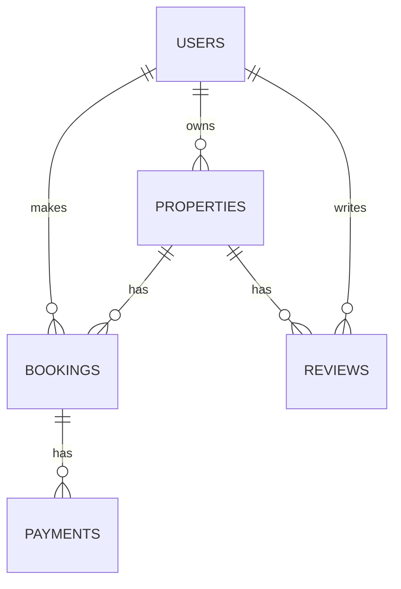

# Rentr - Project Documentation

## Project Overview
Rentr is a web-based property rental system that connects property owners with potential tenants. This documentation explains the key components and implementation details.

## System Architecture

### 1. Database Schema

### 2. Core Features

#### User Authentication
- Secure registration with validation
- Login/Logout functionality
- Session management
- Remember me feature

#### Property Management
- Property listing
- Search and filter properties
- Property details view

#### Booking System
- Property availability checking
- Booking management
- Payment integration (placeholder)

## Technical Implementation

### Key Files
1. `config.php` - Database connection and configuration
2. `login.php` - User authentication
3. `register.php` - New user registration
4. `dashboard.php` - User dashboard
5. `logout.php` - Session termination

### Security Measures
- Password hashing using `password_hash()`
- Prepared statements for database queries
- Input validation and sanitization
- Session security

## Setup Instructions
1. Import `database_setup_updated.sql` to MySQL
2. Configure `config.php` with database credentials
3. Access via web server (e.g., XAMPP)

## Demonstration Points
1. User registration flow
2. Login/Logout functionality
3. Property browsing (if implemented)
4. User dashboard

## Future Enhancements
1. Admin dashboard
2. Advanced search filters
3. Payment gateway integration
4. Email notifications
